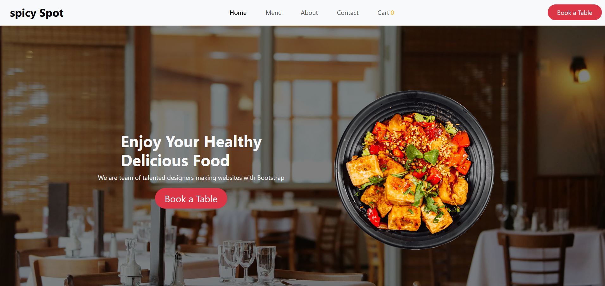

# Restaurant Website

This is a responsive restaurant website built with **React.js** and **Bootstrap**. The website showcases the menu, provides location information, and offers a simple user-friendly interface for the restaurant's customers.

<div align="center">
  
   <h1>Preview</h1>   
   
   

[Live](https://spicy-spot.netlify.app/) 
     
   
</div>


## Features

- **Responsive Design**: Mobile-friendly layout powered by Bootstrap.
- **React Components**: Reusable components for sections like the menu, footer, and contact form.
- **Smooth Navigation**: Easy-to-use navigation for seamless user experience.
- **Dynamic Content**: Displays restaurant details such as menu items, pricing, and operating hours.

## Technologies Used

- **React.js**: JavaScript library for building the user interface.
- **Bootstrap**: Frontend framework for responsive and modern design.
- **CSS**: For custom styling and design enhancements.

## Installation

To run this project locally, follow the steps below:

1. Clone the repository:
   ```bash
   git clone https://github.com/alagar2604/practice.git
